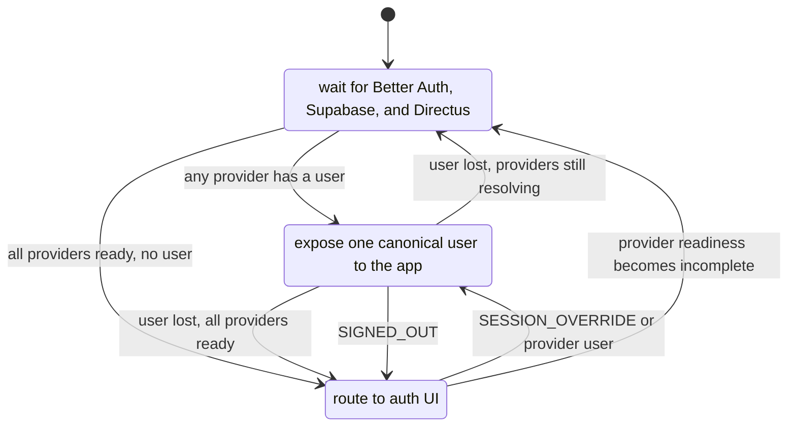
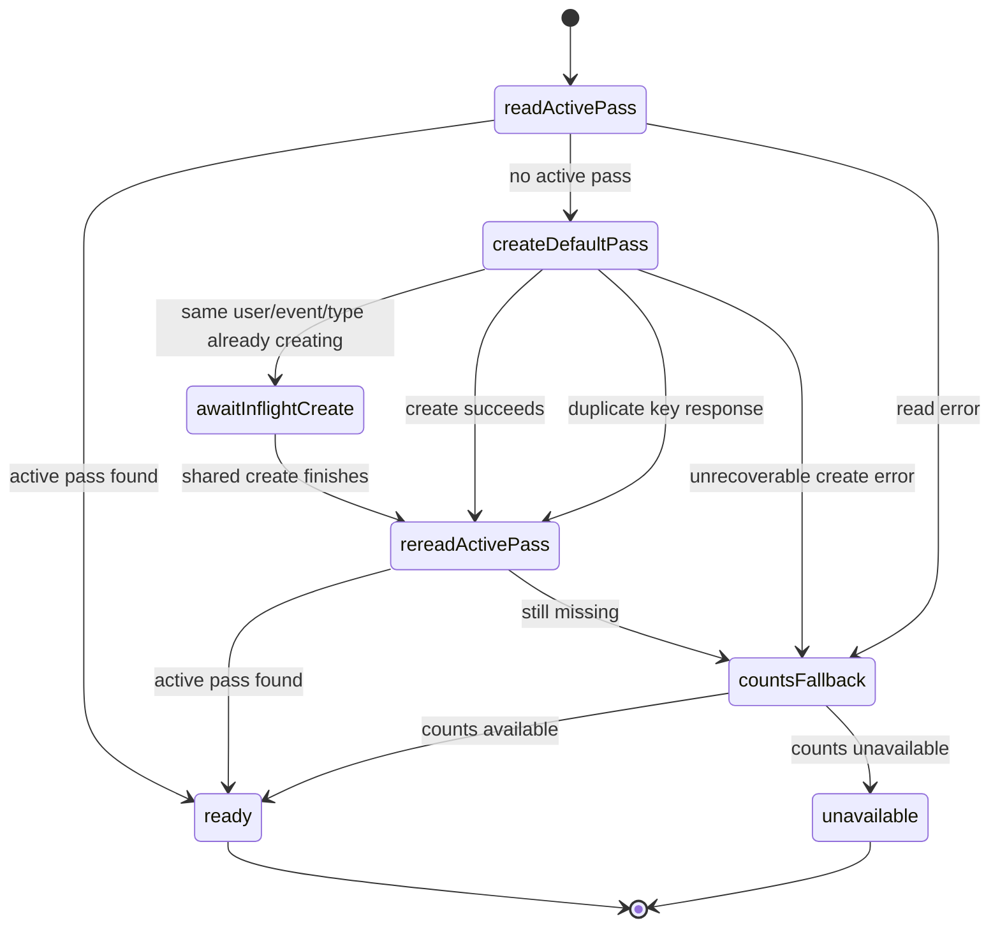

# Mobile Auth State Machine

This document shows the intended auth circuit for the mobile app. It covers
session resolution and the post-auth pass bootstrap that runs after a user is
logged in.

## Session Circuit

The implemented XState machine lives in
`apps/mobile-app/hooks/auth-session-machine.ts`.



## Provider Priority

The machine chooses the first available user in this order:

1. Explicit session override.
2. Better Auth.
3. Supabase.
4. Directus.

This prevents a stale legacy provider from replacing a newer session.

## Post-Auth Pass Circuit

After `authenticated`, the app may need a pass before networking features work.
The pass circuit must be idempotent because root layout, dashboard widgets, and
event screens can ask for pass data at the same time.



## Event ID Boundary

Routes can use the BSL hub id `bsl`. Pass storage uses `bsl2025`. Pass-system
code must normalize the route id before it queries `passes` or calls pass-related
RPCs.

```text
route event id: bsl
storage event id: bsl2025
```

## Emulator Finding

The `1.8.228` emulator build did not crash on cold launch. The log showed this
post-auth failure instead:

```text
No active pass found for user, attempting to create one...
Error creating default pass: duplicate key value violates unique constraint "passes_pkey" for event bsl
```

The fix makes that path predictable:

1. Only one default pass creation can run for a user, event, and pass type.
2. Duplicate-key create responses trigger a pass re-read.
3. BSL pass reads use `bsl2025`, matching stored pass rows.
4. Unrecoverable errors fall back to counts and do not block auth.

The auth deep-link run on the same build reached an authenticated app state and
then died on a native Fabric event:

```text
Error: Unsupported top level event type "topInsetsChange" dispatched, js engine: hermes
```

`react-native-safe-area-context@5.4.0` generated Fabric code dispatches
`insetsChange`, but its Android Fabric event class emitted `topInsetsChange`.
The package patch keeps Paper on `topInsetsChange` and changes Fabric to
`insetsChange`.

A later emulator run on the installed `1.8.228` build exposed the same class of
bug in two more Android packages:

```text
Error: Unsupported top level event type "topLayout" dispatched, js engine: hermes
Error: Unsupported top level event type "topAttached" dispatched, js engine: hermes
Error: Unsupported top level event type "topWillAppear" dispatched, js engine: hermes
Error: Unsupported top level event type "topTransitionProgress" dispatched, js engine: hermes
Error: Unsupported top level event type "topFinishTransitioning" dispatched, js engine: hermes
```

The app has `newArchEnabled=true`, so Android native events must match Fabric's
generated event names. The runtime fix avoids registering app-owned Android
`onLayout` handlers on dashboard surfaces, and the `react-native-screens` patch
normalizes native events to generated names such as `attached`, `willAppear`,
`transitionProgress`, and `finishTransitioning`.
