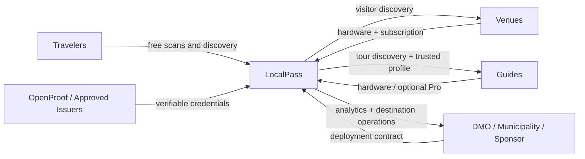

# Business model

## Product family

| Product | Primary user | Job to be done | Commercial role |
|---|---|---|---|
| LocalPass | Traveler | Discover and navigate a destination with unreliable connectivity | Free core experience / demand layer |
| LocalPass Node | Venue / tourism office / terminal | Distribute local information and destination packs without depending on mobile data | Hardware + venue subscription |
| LocalPass Guide | Human guide / tour operator | Carry a programmable destination badge with dynamic QR and local Wi-Fi content | Hardware + guide tools |
| LocalPass Destination | Municipality / DMO / sponsor | Operate many Nodes, Guides, packs and verified listings | B2B deployment + recurring platform |
| OpenProof / approved issuer | Credential issuer | Verify guide/operator credentials | Trust service / verification workflow |

## Recommended pricing architecture

The values below are **pilot hypotheses**, not published pricing.

### Traveler

- Core guide: free.
- Offline destination pack: free.
- Basic QR access: free.
- Optional consumer premium features can be explored later, but are not required for the network to work.

### Venue

Illustrative validation range:

- LocalPass Node activation/hardware: **USD 49–99 one-time**.
- Venue software/service: **USD 8–20/month**.
- Premium destination placement must be clearly identified as sponsored; trust/relevance ranking should not be silently sold.

### Guide

Illustrative validation range:

- Software QR profile: free.
- Verified Guide workflow: free or sponsor-funded in launch cohorts; later may include a reasonable verification processing fee.
- LocalPass Guide wearable: **USD 59–89 one-time** target retail range.
- Guide Pro tools: **USD 5–10/month** target validation range.

A payment can cover processing or hardware. It **cannot purchase certification**.

### Destination / enterprise

Potential contract:

- deployment setup;
- bulk hardware;
- destination pack creation and maintenance;
- admin console;
- analytics;
- credential issuer integration;
- support and service-level terms.

Pricing should be quoted based on deployment scope rather than forced into a self-serve plan before pilots establish costs.

## Hardware acquisition paths

LocalPass should support four paths:

1. **Buy** — professional guide or venue purchases hardware.
2. **Loan** — first pilot cohorts receive hardware for a fixed trial period.
3. **Earn-to-own** — device ownership transfers after measurable contribution and maintenance milestones.
4. **Sponsored deployment** — municipality, DMO, hotel group, tourism board or corporate partner funds devices for qualified operators.

Permanent free hardware is not the default because it can reduce perceived value and create inactive inventory.

## Earn-to-own example

A pilot may define a device value of USD 69 and transfer ownership after a guide reaches a transparent combination such as:

- 20 completed tours;
- 300 visitor scans;
- 90% healthy device check-ins during active tour days;
- current destination information;
- acceptable traveler feedback;
- no policy or credential violations.

These thresholds are examples and should be tuned by pilot data.

## Revenue architecture

## Why hardware exists

Hardware is not the moat by itself.

It creates:

- physical distribution;
- persistent destination presence;
- zero/low-connectivity access;
- trusted device identity;
- measurable scans and interactions;
- a reason for operators to participate in the network.

The long-term asset is the destination network and its trusted physical-to-digital graph.
