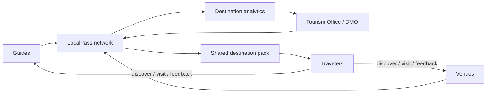

# Go-to-market

## Recommended beachhead

Start with one dense destination where LocalPass can prove a complete physical network.

Current MVP destination: **Guatapé, Antioquia, Colombia**.

A useful pilot target is not “thousands of users.” It is enough density that a traveler repeatedly encounters LocalPass during one trip.

Example pilot:

- 10–20 venue Nodes;
- 10–30 active Guides;
- one maintained destination pack;
- one tourism office / DMO partner if available;
- several independent local businesses.

## Buyer sequence

### Phase 1 — design partners

Recruit:

- hostels/hotels;
- cafés;
- tour operators;
- independent guides;
- tourism office;
- transport terminal/partners;
- attractions.

Offer a time-limited pilot with clear responsibilities.

### Phase 2 — sponsor

Find one organization that benefits from destination-wide coverage:

- municipality;
- DMO;
- chamber of commerce;
- hotel group;
- tourism association;
- transportation partner;
- ecosystem sponsor.

Sell a managed deployment rather than 50 individual hardware transactions.

### Phase 3 — repeatable destination kit

Package:

- destination onboarding;
- content schema;
- Nodes;
- Guide devices;
- operator dashboard;
- issuer registry;
- analytics;
- field support playbook.

## Pilot experiments

Test at least:

1. free software QR vs verified profile;
2. paid hardware vs sponsored hardware;
3. fixed Node vs wearable Guide scan behavior;
4. static venue QR vs dynamic attraction QR;
5. operator reward incentives;
6. traveler trust response to credential provenance;
7. offline usefulness after disconnection.

## Rollout diagram

## What not to do

- Do not manufacture thousands of units before paid/sponsored pilots.
- Do not require a LocalPass device to participate in the QR network.
- Do not make OpenProof the only possible credential issuer.
- Do not turn rewards into a speculative token.
- Do not promise emergency, legal or safety guarantees from community-maintained data.
