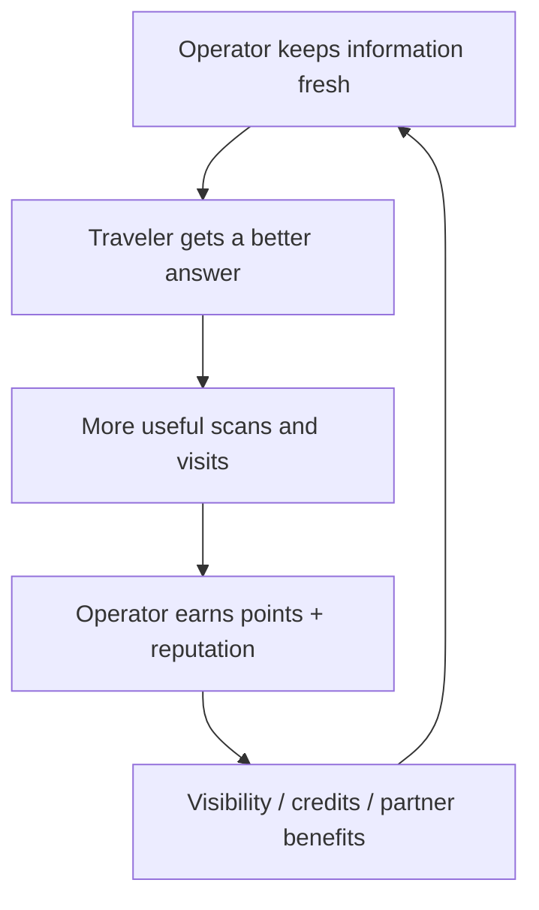

# Operator rewards

LocalPass Rewards exists to solve a practical deployment problem:

> Why would a venue or guide keep the hardware powered, accurate and useful after installation day?

Rewards must improve destination quality rather than create meaningless engagement.

## Rewardable actions

Examples:

- keep destination/business information current;
- verify opening hours;
- report closures or route changes;
- maintain healthy Node/Guide status;
- contribute useful local places;
- translate or improve destination information;
- answer traveler feedback;
- complete optional verification;
- maintain credential validity;
- participate in destination-quality reviews.

Avoid rewarding raw scan inflation.

## Venue and guide tiers

### Community

- free account;
- basic QR/profile;
- destination packs;
- no certification claim.

### Verified

- identity/profile verification completed;
- dynamic QR;
- public verification status;
- eligible for hardware pilot;
- richer analytics.

### Certified / Trusted Local

- qualifying professional credential from an approved issuer;
- credential provenance visible;
- eligibility for official destination programs;
- higher trust presentation.

Certification must never be purchasable solely by paying LocalPass.

## Gamification

Useful mechanics:

- missions;
- information-freshness streaks;
- badges;
- Bronze / Silver / Gold participation tiers;
- destination contribution leaderboard;
- quality milestones.

Leaderboard scores should be normalized so large venues do not win merely because they have more foot traffic.

## Real economic rewards

Points should unlock concrete benefits such as:

- subscription credits;
- hardware/service discounts;
- partner benefits;
- access to advanced analytics;
- featured editorial collections;
- eligibility for destination campaigns;
- “Trusted Local” presentation where earned;
- sponsor-funded benefits.

Sponsored placement and algorithmic relevance must remain distinguishable.

## Incentive flywheel

## Anti-gaming

The system should discount or reject:

- self-generated scan farms;
- repeated scans from the same device/session;
- falsified opening hours or listings;
- copied content without permission;
- ratings from operators themselves;
- reward loops that encourage unsafe tourist behavior.

A future reputation score should combine verified contributions, freshness, traveler feedback and abuse signals rather than a single vanity metric.
