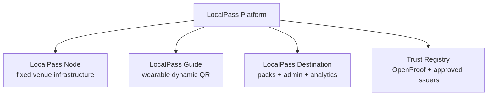
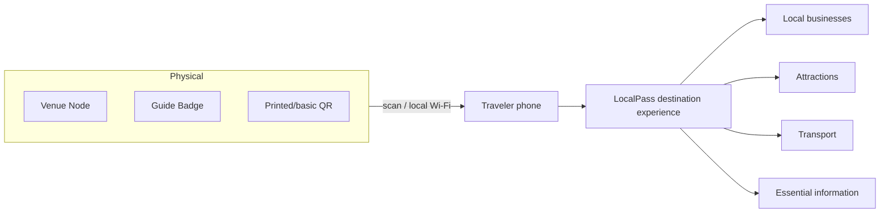
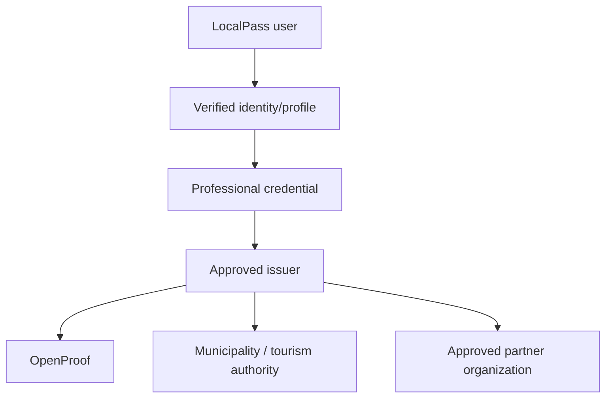
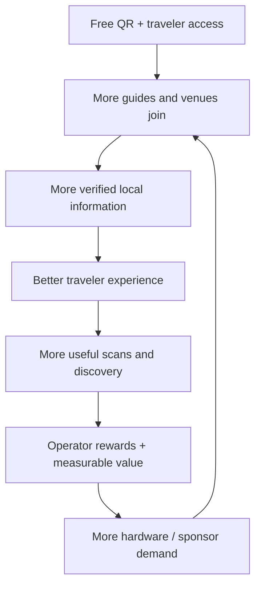
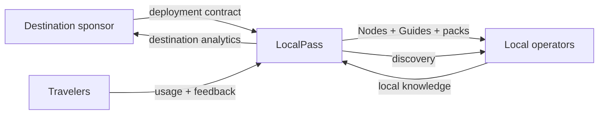

# Commercial and network diagrams

## Product family

## Physical-to-digital network

## Trust layers

OpenProof is an initial issuer/infrastructure option, not a protocol monopoly.

## Commercial flywheel

## B2B destination economics

