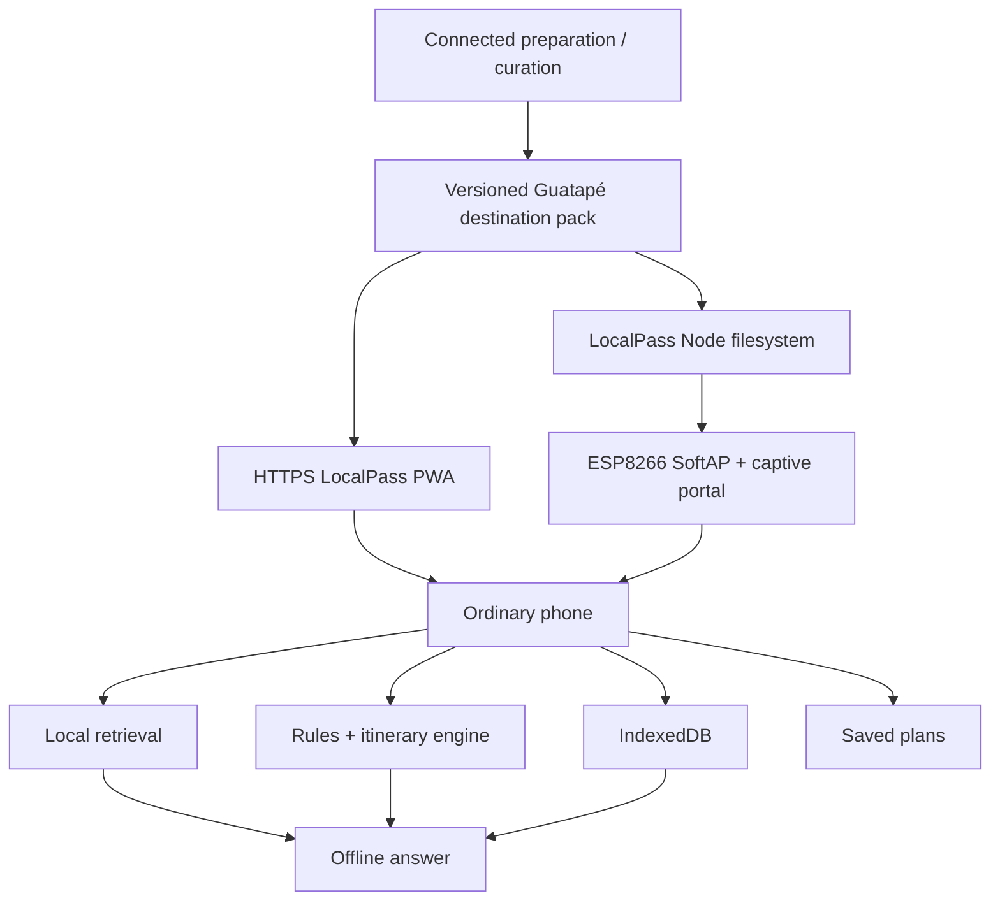
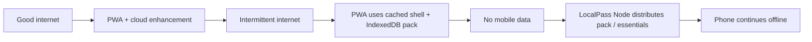
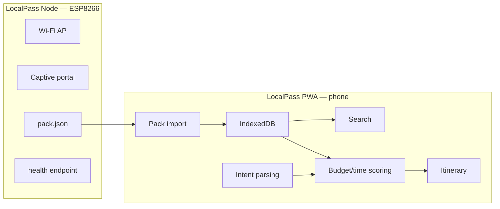
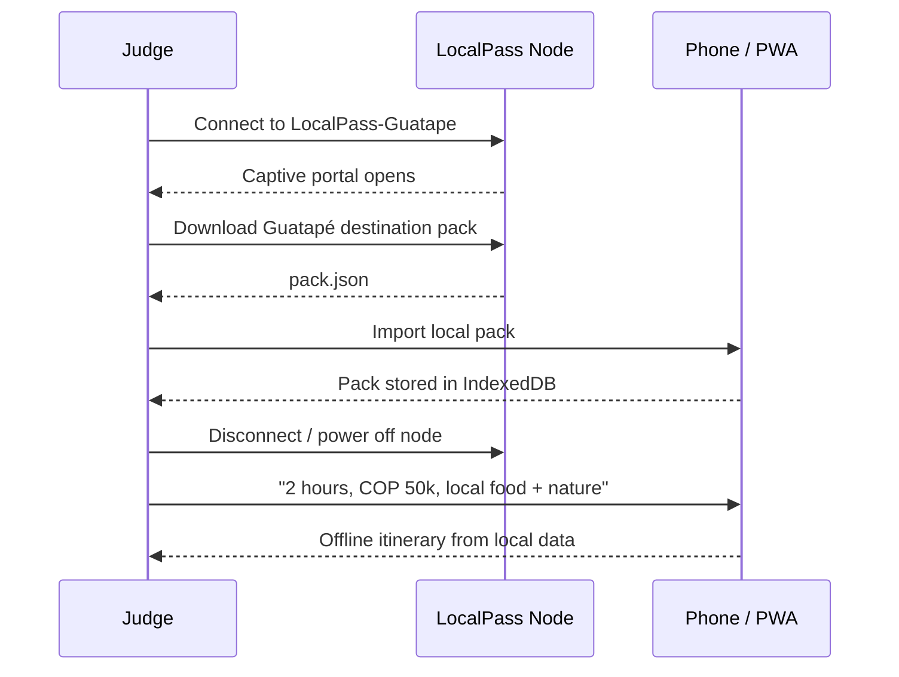
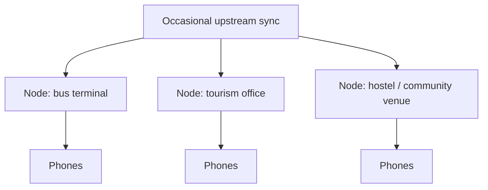

# LocalPass system diagrams

## 1. End-to-end architecture

## 2. Connectivity degradation model

## 3. Hardware/software boundary

## 4. Hackathon demo

## 5. Future field architecture — not MVP

Do not call the MVP a mesh network. Multiple independently synced nodes are roadmap scope.
