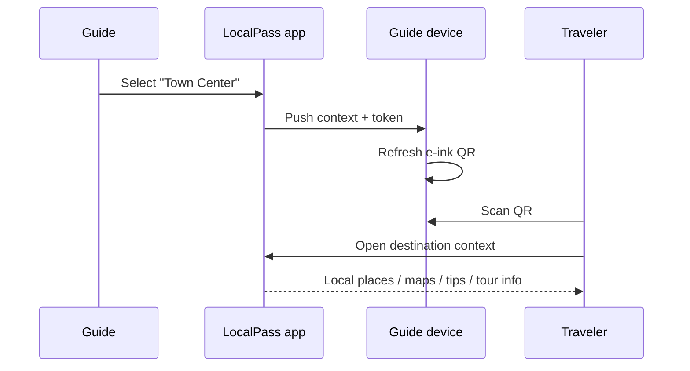

# LocalPass Guide — product specification

Status: concept / pilot specification.

## User story

A certified or community guide moves between attractions during the day.

At each stop the guide selects a destination mode. The badge refreshes its QR and label so travelers scan the correct local context without the guide printing or carrying multiple codes.

## Core requirements

### P0

- dynamic QR;
- active attraction label;
- readable outdoors;
- local battery operation;
- destination/context update from phone;
- basic local Wi-Fi fallback;
- unique device identifier;
- safe inactive state.

### P1

- signed device/session manifest;
- offline destination-pack subset;
- guide credential status indicator;
- scan counters synced when connectivity returns;
- battery telemetry;
- OTA firmware update.

### P2

- NFC tap;
- haptic feedback;
- multilingual on-device labels;
- location-aware context suggestion;
- per-device public HTTPS local hostname/certificate architecture.

## Suggested hardware

Not final BOM:

- ESP32-C3/S3 class MCU;
- 2.13–2.9 inch e-ink display;
- 500–1,000 mAh rechargeable battery;
- USB-C charging;
- flash storage;
- one multi-function button;
- status LED;
- optional secure element;
- BLE + Wi-Fi.

## Device states

```text
BOOT
  -> READY
  -> CONNECTED QR
  -> LOCAL/OFFLINE QR
  -> SYNC
  -> LOW BATTERY
  -> REVOKED/INACTIVE
```

## Guide control flow



## Safety

The badge must not imply:

- a person is certified merely because the device is genuine;
- local information is emergency-grade;
- a route is safe under all conditions.

Credential status comes from the trust layer and can be revoked independently of the hardware.
